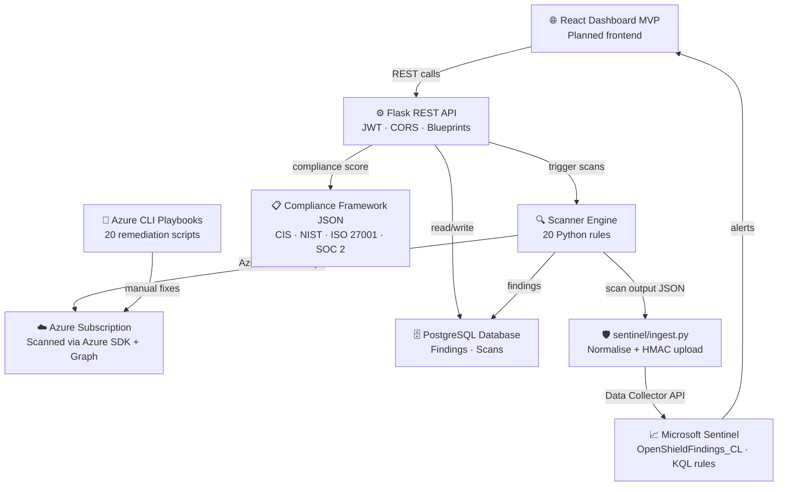

# 🛡️ OpenShield

> **Open source Cloud Security Posture Management (CSPM) for Azure — built by the community, for the community.**

[](https://opensource.org/licenses/MIT)
[](CONTRIBUTING.md)
[](https://github.com/openshield-org/openshield/issues?q=is%3Aissue+label%3Agood-first-issue)
[](https://discord.gg/openshield)

---

## The Problem

Enterprise cloud security tools like **Wiz**, **Prisma Cloud**, and **Microsoft Defender for Cloud** cost **$50,000–$500,000/year**.

Startups, SMEs, universities, and student teams are left with **zero visibility** into their Azure security posture. A misconfigured storage blob, an overprivileged service principal, or an open NSG rule can sit undetected for months.

**OpenShield changes that.**

---

## What OpenShield Does

| Feature | Description |
|---|---|
| **Misconfiguration Scanner** | Runs 20 Azure security rules across storage, network, identity, database, compute, and Key Vault |
| **Compliance Mapper** | Maps findings to CIS Benchmarks, NIST CSF, ISO 27001, and SOC 2 framework JSON files |
| **Scan History API** | Stores scans and findings in PostgreSQL and exposes findings, score, scan history, and compliance posture over REST |
| **Remediation Playbooks** | Every current rule ships with a matching Azure CLI remediation script |
| **Security Dashboard** | Frontend scaffold is present; the React dashboard MVP is still on the roadmap |
| **Sentinel Integration** | Normalises findings and pushes them into Microsoft Sentinel via a Log Analytics custom table and KQL analytics rules |

---

## 🏗️ Architecture



## Tech Stack

| Layer | Technology | Cost |
|---|---|---|
| Frontend | Scaffolded dashboard app (React + Tailwind planned) | Free |
| Backend API | Python + Flask | Free |
| Database | PostgreSQL | Free (Render/Azure free tier) |
| Cloud Scanner | Python + Azure SDK | Free |
| Remediation | Azure CLI playbooks | Free |
| SIEM | Microsoft Sentinel | 90-day free trial |
| CI/CD | GitHub Actions | Free |
| Repo | GitHub | Free |

---

## Project Structure

```
openshield/
├── scanner/               # Azure misconfiguration rule engine
│   ├── rules/             # Individual scan rules (contribute here!)
│   ├── engine.py          # Core scanning orchestration
│   └── azure_client.py    # Azure SDK wrapper
├── compliance/            # Framework mapping engine
│   └── frameworks/        # CIS, NIST, ISO 27001, SOC 2 mappings
├── playbooks/             # Remediation playbooks
│   ├── arm/               # Reserved for future ARM templates
│   ├── terraform/         # Reserved for future Terraform fixes
│   └── cli/               # Azure CLI scripts
├── api/                   # Flask REST API
│   ├── routes/
│   └── models/
├── frontend/              # Dashboard scaffold
├── sentinel/              # Sentinel integration & KQL rules
├── .github/workflows/     # CI checks
├── docs/                  # Documentation
├── CONTRIBUTING.md
└── README.md
```

---

## Quick Start

```bash
# Clone the repo
git clone https://github.com/openshield-org/openshield.git
cd openshield

# Install Python dependencies
pip install -r requirements.txt

# Set your Azure credentials
export AZURE_SUBSCRIPTION_ID=your-subscription-id
export AZURE_CLIENT_ID=your-client-id
export AZURE_CLIENT_SECRET=your-client-secret
export AZURE_TENANT_ID=your-tenant-id

# Run a scan
python -c "
from scanner.engine import ScanEngine
import json, os
result = ScanEngine(os.environ['AZURE_SUBSCRIPTION_ID']).run_scan()
print(json.dumps(result, indent=2))
"

# Start the API
FLASK_APP=api/app.py flask run
```

---

## 🤝 Contributing

We actively welcome contributions from students and developers at all levels.

**Ways to contribute:**
- 🔍 Add a new misconfiguration scan rule
- 📋 Add a compliance framework mapping
- 🔧 Write a remediation playbook
- 🐛 Fix a bug
- 📖 Improve documentation

👉 See [CONTRIBUTING.md](CONTRIBUTING.md) for a full guide — including how to add your first rule in under 30 minutes.

Contributors are credited below.

---

## 📍 Roadmap

- [x] Project scaffolding
- [x] Core scanner engine (Azure SDK integration)
- [x] 20 scan rules
- [x] Flask API + PostgreSQL schema
- [ ] React dashboard MVP
- [x] CIS Benchmark compliance mapping
- [x] SOC 2 compliance mapping
- [x] Sentinel alert integration
- [x] Real-world breach scenarios documented
- [x] First external contributor PR merged
- [x] Azure CLI remediation playbook library
- [x] NIST CSF + ISO 27001 mappings
- [x] GitHub Actions CI pipeline
- [ ] Multi-cloud support (AWS, GCP)

---

## Contributors

Thanks to everyone who has contributed to OpenShield.

| Contributor | GitHub | Contribution |
|---|---|---|
| Vishnu Ajith | @Vishnu2707 | Architecture, core scanner, API, compliance mappings |
| Tanvir Farhad | @TFT444 | Sentinel integration, network rules, playbooks, breach scenarios |
| Parth J Rohit | @parthrohit22 | AZ-KV-002 Key Vault public access rule and playbook |
| Ritik Sah | @ritiksah141 | AZ-STOR-003 storage lifecycle rule and CI pipeline |

---

## 📄 License

MIT — free to use, modify, and distribute.

---

> Built with ❤️ by security engineers and students who believe cloud security tooling should be accessible to everyone.
