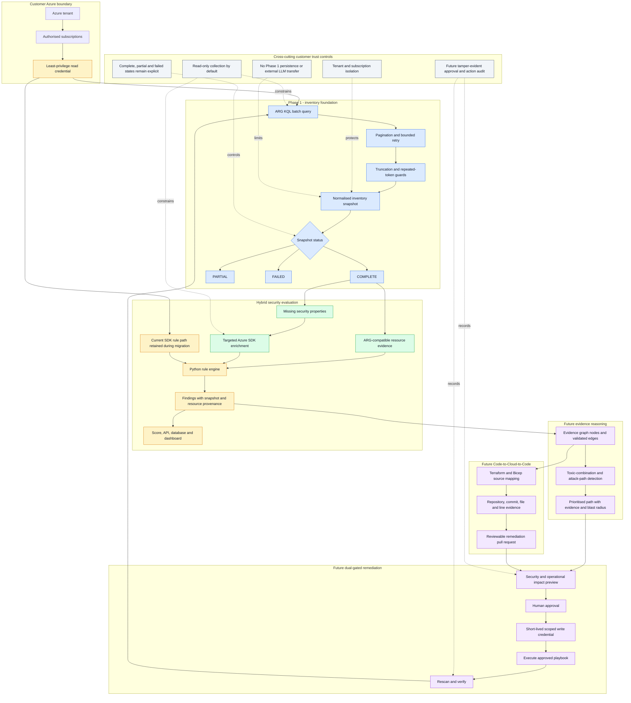

# OpenShield Evidence Graph

## Status

This document is an architecture proposal tracked by issue #249. Azure Resource Graph inventory is Phase 1. Attack-path correlation,
Code-to-Cloud tracing, and controlled remediation are future phases and are not presented as implemented features.

## Purpose

OpenShield currently evaluates many security controls independently. The proposed Evidence Graph will connect Azure
resources, identities, permissions, exposures, findings, infrastructure code, and remediation evidence into one
traceable security model.

## Target architecture

The target is a hybrid scanner. ARG performs broad resource discovery, Python remains the orchestration and rule
engine, and Azure SDK calls are retained only where ARG cannot supply the required evidence.



Diagram status:

- **Blue:** implemented by PR #250.
- **Amber:** existing OpenShield components retained during migration.
- **Green:** the next integration step required for a fair end-to-end speed benchmark.
- **Purple:** later Evidence Graph, Code-to-Cloud, and controlled-remediation phases.
- **Grey:** customer-trust controls that apply across the architecture.

The live Azure for Students benchmark returned five resources with a 0.438-second median ARG inventory time. The
existing Python scanner ran 68 rules and returned 643 findings in 113.167 seconds. These results demonstrate the
inventory opportunity but are not presented as an end-to-end speedup until migrated rules produce equivalent
findings from the shared snapshot.

## Customer Trust Layer

The Evidence Graph must be built on controls that protect customer environments and keep evidence attributable.

- **Tenant isolation:** every record carries a tenant, subscription, and snapshot boundary. Cross-boundary records are
  rejected rather than silently combined.
- **Read-only collection:** ARG inventory and normal scanning use read permissions and do not change Azure resources.
- **Approved temporary write access:** a future remediation path must request narrowly scoped, short-lived access only
  after human approval.
- **Tamper-evident audit:** future execution must record the proposal, approval, identity, action, and verified outcome.

Phase 1 keeps collected data in the scanner process. It does not send the snapshot to an LLM or another external
service, and it does not persist the snapshot until a tenant-scoped storage design is approved.

Open source code provides inspectability, but these runtime boundaries are still required before an enterprise can
trust the platform with cloud metadata or remediation access.

## Phase 1: High-speed Azure resource scanning

Phase 1 uses Azure Resource Graph for broad, batched discovery across authorised subscriptions. ARG results are
normalised into a bounded snapshot containing resource identity, type, location, tenant, subscription, resource
group, tags, properties, collection time, pagination count, and collection errors.

ARG does not expose every security-relevant property. OpenShield will therefore use a hybrid model:

```text
ARG batch discovery -> normalised snapshot -> targeted Azure SDK enrichment
```

The current SDK scanner remains available while ARG completeness is measured. No existing rule is migrated until its
required evidence is confirmed to be present or safely enriched.

### Failure semantics

- `COMPLETE`: every requested ARG page was collected, including a valid empty result.
- `PARTIAL`: some resources were collected, but a later page, scope, or record could not be trusted.
- `FAILED`: collection failed before any ARG page was accepted.

A partial or failed collection must never be represented as a clean security result.

### Benchmark protocol

Performance claims must be measured against a defined environment. Record:

- number of authorised subscriptions;
- total resources returned;
- ARG page count and collection duration;
- resource types and required fields missing from ARG;
- targeted SDK calls required after discovery;
- throttling, partial-scope, and permission errors;
- equivalent current-scanner collection time.

The proposed sub-30-second scan time is a benchmark target, not a guarantee.

## Phase 2: Evidence-based attack paths

Resources become graph nodes and validated relationships become edges. Every edge must retain its source, collection
time, and confidence. The first proof should connect one realistic combination, such as public exposure,
overprivileged identity, and access to sensitive data, into one prioritised path.

Deterministic security logic should construct and score the path. An LLM may explain verified evidence but must not
invent relationships.

## Phase 3: Code-to-Cloud-to-Code

Runtime resources will be traced to Terraform or Bicep using deployment metadata, resource addresses, source ranges,
repository identity, and commit identity. Resource-name similarity alone is insufficient evidence. A proposed fix
must be delivered as a reviewable pull request rather than an unreviewed code change.

## Phase 4: Dual-gated remediation

A future remediation workflow must:

1. Preview the expected security and operational effect.
2. Require explicit human approval.
3. Obtain temporary, narrowly scoped write access.
4. Execute only the approved operation.
5. Rescan and verify whether the attack path was broken.
6. Preserve before-and-after evidence in the audit record.

Simulation and deployment previews reduce risk but cannot prove zero production disruption.

## Initial success criteria

- A tenant-isolated ARG snapshot can cover one or more authorised subscriptions.
- Pagination, throttling, empty results, partial results, and failures remain distinguishable.
- Resource completeness and scan duration are measured against the existing scanner.
- One later attack path can cite evidence from the snapshot for every relationship.
- No production resource is modified during Phase 1.

## Non-goals for Phase 1

- Replacing every Azure SDK call.
- Building the complete attack graph.
- Generating infrastructure remediation pull requests.
- Executing production changes.
- Claiming a performance target before benchmark evidence exists.

## References

- [Azure Resource Graph overview](https://learn.microsoft.com/azure/governance/resource-graph/overview)
- [ARG pagination API](https://learn.microsoft.com/rest/api/azureresourcegraph/resourcegraph/resources/resources)
- [ARG throttling guidance](https://learn.microsoft.com/azure/governance/resource-graph/concepts/guidance-for-throttled-requests)
